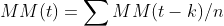
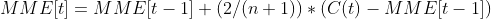
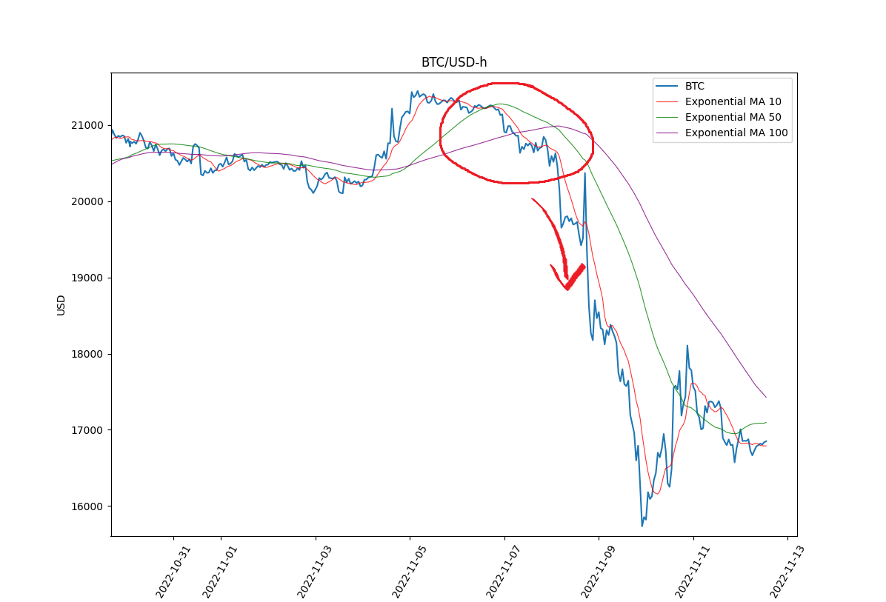
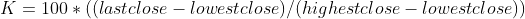
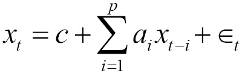
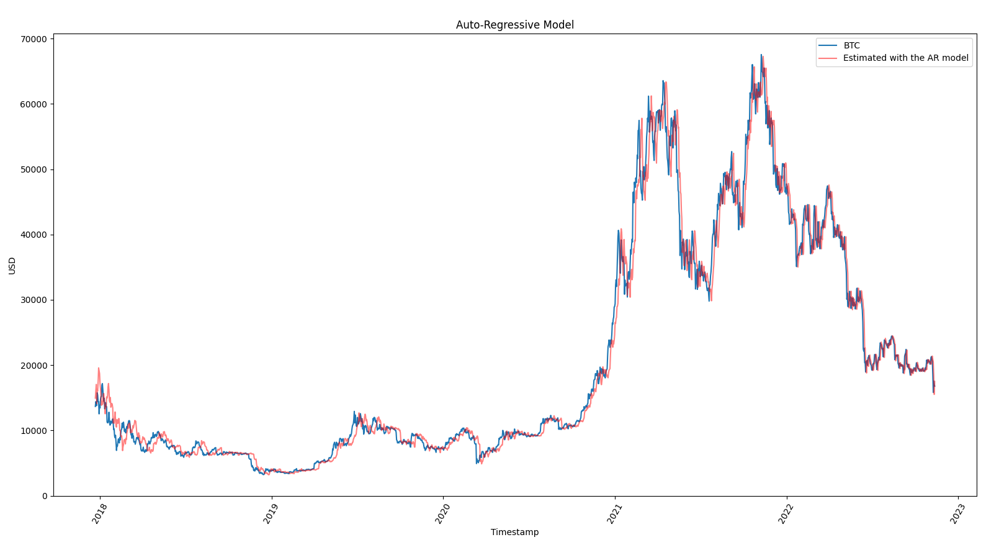
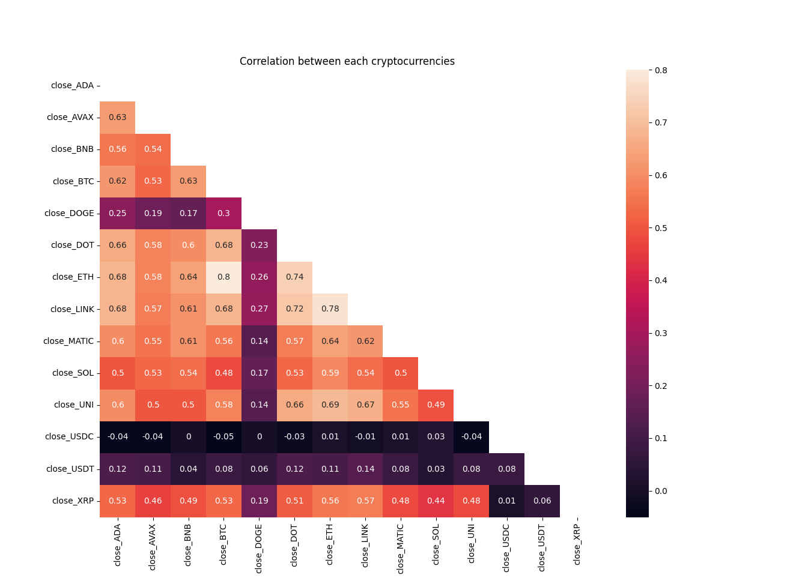

# __Stochastic Project - Time Series Analysis__

 
 

Our objective for this project was to try to establish an investment strategy in crypto-assets using stochastic calculations. We then chose some relevant mathematical tools to demonstrate phenomena such as trend reversal, overbought and correlation between all these currencies.

---
## __Analysis tools and interpretation of results__
### __Moving Average__  

Moving averages are technical trend indicators, which are used in technical analysis to invest in different financial instruments.
A moving average provides the average price of a stock over a given period.  
Let *MM* be the moving average, *t* be the selected time and *n* be the number of selected periods:

This average allows a series of values expressed as a function of time to be smoothed.

However, investors prefer to use an exponential moving average, which is much more responsive than the simple moving average because it is weighted with respect to the latest values. 
Let *MME* be the exponential moving average, *t* be the time chosen, *C(t)* be the current asset value and n be the number of periods chosen:

Exponential moving averages are of interest because they are more reactive and therefore more interesting to analyse.  

We know that when a moving average curve crosses another moving average, the downward or upward trend of the currency is reversed. When a moving average of a certain period passes "below" a moving average with a longer period, the trend of the curve becomes bearish and vice versa.  
This is exactly what we can observe on this curve: The 10-hour moving average falls below the 50-hour moving average, which in turn falls below the 100-hour moving average just after. Following these inversions, we notice a very sharp drop in the value of Bitcoin (≈-23% in 3 days).  
Of course, this drop did not happen because of the crossing of these average curves but because of a real economic event. The bankruptcy of the 4th largest crypto exchange FTX caused a general panic encouraging people to sell their crypto-currencies, driving down the price of BTC, ETH and therefore all other tokens (cf. [Correlation Matrix](#correlation-matrix)).  
Nevertheless, the analysis of the moving averages indicated a forthcoming fall in the market and made it possible to anticipate these events without being aware of the news.
### __Stochastic Indicator__  
The stochastic indicator is a frequently used indicator that represents the relative position of the price within a historical range.  
It is calculated using this formula:

Investors often compare this index to straight lines at 80% and 20%. When the index falls below 20% it can be considered oversold and therefore a purchase at that point should be profitable, conversely when the index rises above 80% it is overbought and will most likely rebalance and fall back below 80%.

It is noticeable that the recent fall in crypto currencies due to FTX has pushed the Bitcoin curve into the oversold zone below 20%. This is theoretically a good time to take a position as we can imagine the price rising again soon. However, nothing is certain and the market could be bearish for a long time to come.

### __Autoregressive Model__
An autoregressive model is a linear method for predicting a value *X(t+1)* based on a number *p* of values preceding it.

We therefore chose to test our model on the Bitcoin curve over the last 2000 days to compare our prediction with the real values.

It can be seen that our curve prediction is very close to the real curve with very little error. However, this can be explained by the fact that we trained our model with the previous values of the real curve and not with the previous values generated by our model. If this had been the case, our model would have been much less reliable. However, it did allow us to understand the interest and the functioning of an autoregressive model on such a data set.

### __Correlation Matrix__
The cryptocurrency ecosystem is known for its high volatility and its so-called bull run and bear market periods, which affect all of these assets. We therefore wanted to show here that crypto-currencies have a very strong correlation, especially with bitcoin which seems to be the master of this market.

As we can see in this matrix generated from our *correlation.py* script, almost all correlation values are above 0.5, except for the stable assets that follow FIAT currencies such as the US dollar (represented in purple).
There are even very large values such as 0.77 between Bitcoin and Ethereum, which shows a very strong impact of both. This is why most investors own a lot of Bitcoin and Ethereum, as these crypto-currencies dictate the market. So, this is a reminder that when an investor wants to take a position, they should always pay attention to other crypto-currencies, including the most important ones like BTC, ETH, BNB... Indeed, if there is a drop in a cryptocurrency because of a news that causes a panic movement, the whole market can collapse.

---
## Conclusion
Through this project, we learned about time series analysis using mathematical tools. We have seen that it is possible to get a lot of information from past values, in order to predict the future. However, there are always risks and predictions will never be completely reliable due to the volatility of this market. This project was therefore a very good introduction to the notions of machine learning that we will explore later.
